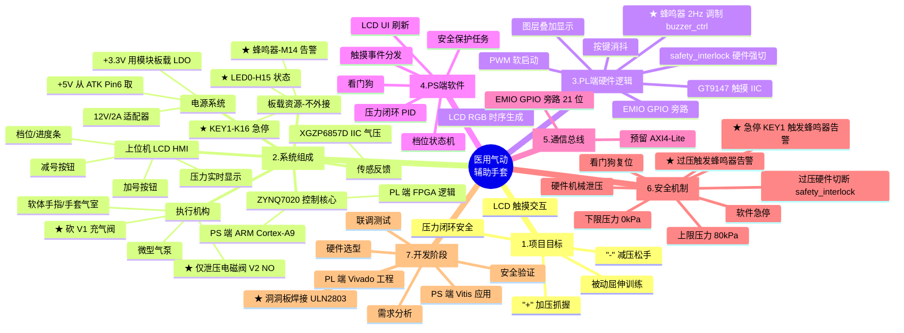

# 医用气动辅助手套 - 项目思维导图

> 基于 正点原子领航者 ZYNQ7020 + 800×480 触摸 LCD 的医用气动辅助手套
> 创建日期：2026-05-11
> 修订：2026-05-13（★ 砍 V1 充气阀, ULN2803 焊接洞洞板, 板载蜂鸣器告警）

---

## 一、项目总览（Mermaid 思维导图）

> 在 VS Code 中安装 "Markdown Preview Mermaid Support" 插件即可可视化预览。



---

## 二、文本结构展开（树形大纲）

```
医用气动辅助手套项目
│
├─ 1. 项目目标
│   ├─ 1.1 功能需求
│   │   ├─ "+" 按钮：气泵加压 → 软体手指弯曲 → 抓握
│   │   ├─ "-" 按钮：泄压阀打开 → 软体手指回弹 → 松手
│   │   ├─ LCD 显示当前压力 (kPa)、档位、状态
│   │   └─ 触摸按键面积 ≥ 80×80 px，便于患者操作
│   ├─ 1.2 性能指标
│   │   ├─ 工作压力：0 ~ 80 kPa（柔性安全范围）
│   │   ├─ 响应时间：< 500 ms
│   │   ├─ 显示刷新率：≥ 30 FPS
│   │   └─ 压力控制精度：±2 kPa
│   └─ 1.3 适用场景
│       ├─ 脑卒中后手指屈曲挛缩康复
│       ├─ 末梢神经损伤被动训练
│       └─ 高校 / 个人实验性研究
│
├─ 2. 系统硬件架构
│   ├─ 2.1 主控：ZYNQ7020（XC7Z020CLG400-2）
│   │   ├─ PS：双核 ARM Cortex-A9，跑裸机或 FreeRTOS
│   │   └─ PL：85K 逻辑单元，跑 LCD/IIC/PWM/蜂鸣器逻辑
│   ├─ 2.2 人机界面：7" 800×480 RGB 电容触摸屏（GT9147）
│   ├─ 2.3 气动执行 (★ 砍 V1 简化版)
│   │   ├─ 微型隔膜气泵（12V，约 1.5~3 L/min）
│   │   ├─ ~~二位三通常闭电磁阀 V1（充气控制）~~ ★ 已砍
│   │   ├─ 二位二通常开电磁阀 V2（泄气控制, 项目唯一主动阀）
│   │   ├─ 普通手套 + 气球/橡胶指套 (低成本气室)
│   │   └─ Φ4 PU 气管 + 快插接头 + 1 个三通 (并联气压传感器)
│   ├─ 2.4 反馈传感
│   │   └─ XGZP6857D 数字 IIC 气压传感器 (0~100 kPa)
│   ├─ 2.5 驱动与电路板 (★ 洞洞板焊接版)
│   │   ├─ ULN2803APG 达林顿阵列 (DIP-18, 焊在 IC 座)
│   │   ├─ 1N4007 ×2 续流二极管 (反向并联在气泵/V2)
│   │   ├─ 4.7K ×2 上拉电阻 (IIC SDA/SCL → +3.3V)
│   │   ├─ 9×15cm 洞洞板 (4 条电源轨 + ULN2803 + 端子)
│   │   ├─ KF301-2P 接线端子 ×2 (接气泵 +/− 和 V2 +/−)
│   │   ├─ 6 芯杜邦线 (ATK MODULE U4 → 洞洞板)
│   │   └─ ~~光耦 / MOSFET~~ 不需要 (ULN2803 已隔离反冲)
│   ├─ 2.6 电源 (★ 简化, 不需要 DC-DC 模块)
│   │   ├─ 12V/2A 开关电源 (驱动气泵和阀)
│   │   ├─ +5V 直接从 ATK MODULE Pin6 引出 (来自 ZYNQ 板)
│   │   ├─ +3.3V 直接用气压传感器模块上的板载 LDO
│   │   └─ 共地: 12V 适配器 − 必须接 ZYNQ GND (ATK Pin5)
│   └─ 2.7 板载资源 (★ 无需采购或外接)
│       ├─ LED0 (H15) - 状态指示
│       ├─ KEY1 (K16) - 急停按键
│       ├─ 蜂鸣器 (M14) - 超压/急停 2Hz 告警
│       ├─ KEY_RST (N16) - 系统复位
│       └─ 50MHz 晶振 (U18) - 主时钟
│
├─ 3. PL 端（FPGA 逻辑）开发 (★ 12 个 .v 模块已写完)
│   ├─ 3.1 LCD 控制 (clock_reset / lcd_timing / lcd_display)
│   │   ├─ RGB 时序生成（HSYNC/VSYNC/DE/PCLK）
│   │   ├─ 800×480@60 标准时序
│   │   └─ 中心 200×175 图片显示 (BROM IP)
│   ├─ 3.2 GT9147 触摸驱动 (touch_iic)
│   │   ├─ IIC 主机 + 中断响应
│   │   └─ 5 点触摸坐标解析
│   ├─ 3.3 气压传感器 (pressure_iic)
│   │   └─ XGZP6857D IIC 读取, 地址 0x6D
│   ├─ 3.4 状态机 + PWM (glove_fsm / pwm_ctrl)
│   │   ├─ IDLE/GRIP/HOLD/RELEASE/EMERGENCY
│   │   └─ 气泵软启动 PWM (500ms 斜坡)
│   ├─ 3.5 EMIO 接口 (axi_lite_reg)
│   │   ├─ EMIO GPIO 旁路 (替代 AXI-Lite)
│   │   └─ 21 位寄存器送给 PS 读
│   ├─ 3.6 安全联锁 (safety_interlock)
│   │   └─ ≥80kPa 硬件强切 pump=V2=0 (纯组合)
│   └─ ★ 3.7 蜂鸣器告警 (buzzer_ctrl)
│       ├─ 触发: safety_trigger OR ~emerg_key
│       └─ 输出: 2Hz 间歇方波 → 板载 M14
│
├─ 4. PS 端（ARM 软件）开发
│   ├─ 4.1 框架选择
│   │   ├─ 裸机（Vitis SDK）—— 推荐入门
│   │   └─ FreeRTOS（多任务）—— 进阶
│   ├─ 4.2 任务划分
│   │   ├─ Task_UI：界面刷新、按钮检测
│   │   ├─ Task_Control：压力 PID、状态机
│   │   ├─ Task_Sensor：IIC 读传感器
│   │   └─ Task_Safety：超限保护、急停
│   ├─ 4.3 状态机 (★ 砍 V1 后简化)
│   │   ├─ IDLE：待机，泵=0, V2=0(开), 自动泄气
│   │   ├─ GRIP：抓握，泵=1, V2=1(闭), 持续打气
│   │   ├─ HOLD：保持，泵=0, V2=1(闭), 保压
│   │   ├─ RELEASE：松手，泵=0, V2=0(开), 自然回弹
│   │   └─ EMERGENCY: 强切 pump=V2=0 + ★ 蜂鸣器 2Hz 告警
│   └─ 4.4 PID 闭环（可选）
│       ├─ 输入：目标压力 (kPa)
│       ├─ 反馈：传感器压力
│       └─ 输出：PWM 占空比
│
├─ 5. 软件 / 工具链
│   ├─ Vivado 2020.2（PL 端综合实现）
│   ├─ Vitis 2020.2（PS 端应用开发）
│   ├─ PCtoLCD2002（字模/位图生成）
│   ├─ AutoCAD / SolidWorks（机械手套外形）
│   └─ KiCad / 立创 EDA（接口板原理图与 PCB）
│
├─ 6. 开发里程碑
│   ├─ M1 (Week 1-2)  ：选型、采购
│   ├─ M2 (Week 3-4)  ：LCD 显示、触摸 Demo
│   ├─ M3 (Week 5-6)  ：气泵 / 电磁阀单体测试
│   ├─ M4 (Week 7-8)  ：PL 端 PWM、PS 端状态机
│   ├─ M5 (Week 9-10) ：压力闭环联调
│   ├─ M6 (Week 11)   ：穿戴测试与安全验证
│   └─ M7 (Week 12)   ：文档整理、视频演示
│
├─ 7. 安全与伦理（重要）
│   ├─ 7.1 压力硬上限：< 100 kPa（避免血管/神经损伤）
│   ├─ 7.2 软上限：80 kPa（safety_interlock 模块硬件强切）
│   ├─ 7.3 紧急停止：板载 KEY1 (K16) - 按下即触发蜂鸣 + 强切
│   ├─ 7.4 泄气备份阀 V2：失电常开 NO（断电自动泄压, fail-safe）
│   ├─ ★ 7.5 蜂鸣器告警：板载 M14 - 超压 OR 急停时 2Hz 间歇响
│   ├─ 7.6 续流二极管：1N4007 反向并联气泵/V2, 阴极朝 +12V
│   ├─ 7.7 共地强制: 12V 适配器 − 必须接 ZYNQ GND
│   ├─ 7.8 仅限学习实验，禁止替代医疗器械
│   └─ 7.9 任何穿戴前先用气球 / 假手测试
│
└─ 8. 风险与挑战
    ├─ 软体手指自制难度大（替代：购买成品手套）
    ├─ 气密性要求高（接头胶水密封）
    ├─ 电磁阀响应时间影响控制精度
    ├─ ZYNQ PL 资源消耗（注意 LUT、BRAM 使用率）
    └─ LCD 触摸校准（电容屏需注意干扰）
```

---

## 三、开发顺序建议

```
阶段 1：环境搭建
  └─ 安装 Vivado / Vitis 2020.2 → 跑通正点原子官方 LCD 触摸例程

阶段 2：单点突破（每个模块单独验证）
  ├─ LCD 显示 "+/-" 两个大按钮
  ├─ 触摸读取坐标，区分按下哪个按钮
  ├─ PL 端输出 GPIO 控制 LED 模拟气泵
  └─ PL 端 IIC 读取 XGZP6857D 气压传感器

阶段 3：硬件接入 (★ 洞洞板焊接)
  ├─ 焊洞洞板: ULN2803 IC 座 + 1N4007 ×2 + 4.7K ×2 + 4 条电源轨 + KF301 端子 ×2
  ├─ 杜邦线接 ATK MODULE U4 → 洞洞板
  ├─ 万用表测 ULN2803 OUT1/OUT2 在 grip_req=1 时是否拉低
  ├─ 接气压传感器, 用手挤进气口看屏幕压力变化
  ├─ 接气泵 + V2, 短时通断验证
  └─ 在没人穿戴情况下试运行（用塑料瓶代替手）

阶段 4：闭环控制
  ├─ 实现 "+" 持续按住 → 持续加压（限幅 80 kPa）
  ├─ 实现 "-" 持续按住 → 持续泄压（直到 0 kPa）
  ├─ 显示压力实时曲线
  └─ 加入 PID（可选，开关式控制也可）

阶段 5：穿戴测试
  ├─ 先用假肢 / 别人健康手测试
  ├─ 录制视频，测量响应时间
  └─ 收集反馈，迭代优化
```

---

## 四、参考资料链接

### 中文资料
- [基于 STM32 的气动康复手套设计](https://blog.csdn.net/Candy5204/article/details/147591019)（STM32 方案可借鉴）
- [正点原子 ZYNQ 之 FPGA 开发指南](https://blog.csdn.net/weixin_55796564/article/details/122340925)（LCD 触摸屏实验）
- [气动软体机器人：结构设计、工作原理与制造工艺](https://zhuanlan.zhihu.com/p/163424462)
- [柔性手部可穿戴康复运动辅助系统](https://www.hanspub.org/journal/paperinformation?paperid=109909)
- [多腔体式仿生气动软体驱动器的设计与制作](https://www.zjujournals.com/gcsjxb/fileup/1006-754X/HTML/1006-754X-2017-24-05-511.htm)

### 商用参考
- [北京软体机器人 Pavlov P105 手部镜像康复训练器](https://softrobottech.com/web/zh/news/2022110405251564457487)
- [康复机器人手套（百度百科）](https://baike.baidu.com/item/%E5%BA%B7%E5%A4%8D%E6%9C%BA%E5%99%A8%E4%BA%BA%E6%89%8B%E5%A5%97/24119414)

### 驱动芯片
- [ULN2003 工作原理及中文资料](https://blog.csdn.net/qq_38410730/article/details/79787766)
- [ULN2803 驱动模块的使用](https://blog.csdn.net/zxm8513/article/details/110286045)
