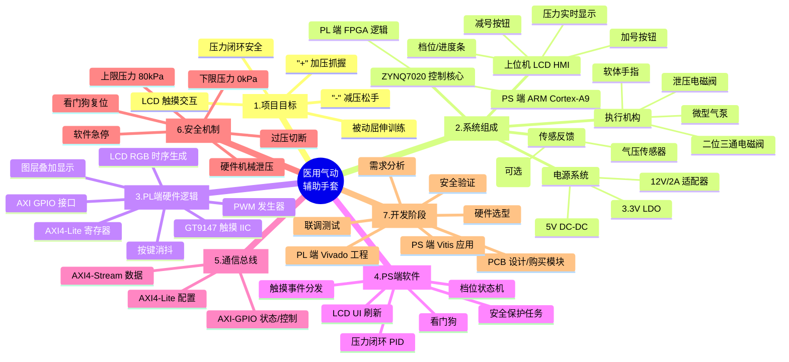

# 医用气动辅助手套 - 项目思维导图

> 基于 正点原子领航者 ZYNQ7020 + 800×480 触摸 LCD 的医用气动辅助手套
> 创建日期：2026-05-11

---

## 一、项目总览（Mermaid 思维导图）

> 在 VS Code 中安装 "Markdown Preview Mermaid Support" 插件即可可视化预览。



---

## 二、文本结构展开（树形大纲）

```
医用气动辅助手套项目
│
├─ 1. 项目目标
│   ├─ 1.1 功能需求
│   │   ├─ "+" 按钮：气泵加压 → 软体手指弯曲 → 抓握
│   │   ├─ "-" 按钮：泄压阀打开 → 软体手指回弹 → 松手
│   │   ├─ LCD 显示当前压力 (kPa)、档位、状态
│   │   └─ 触摸按键面积 ≥ 80×80 px，便于患者操作
│   ├─ 1.2 性能指标
│   │   ├─ 工作压力：0 ~ 80 kPa（柔性安全范围）
│   │   ├─ 响应时间：< 500 ms
│   │   ├─ 显示刷新率：≥ 30 FPS
│   │   └─ 压力控制精度：±2 kPa
│   └─ 1.3 适用场景
│       ├─ 脑卒中后手指屈曲挛缩康复
│       ├─ 末梢神经损伤被动训练
│       └─ 高校 / 个人实验性研究
│
├─ 2. 系统硬件架构
│   ├─ 2.1 主控：ZYNQ7020（XC7Z020CLG400-2）
│   │   ├─ PS：双核 ARM Cortex-A9，跑裸机或 FreeRTOS
│   │   └─ PL：85K 逻辑单元，跑 LCD/IIC/PWM 逻辑
│   ├─ 2.2 人机界面：7" 800×480 RGB 电容触摸屏（GT9147）
│   ├─ 2.3 气动执行
│   │   ├─ 微型隔膜气泵（12V，约 1.5~3 L/min）
│   │   ├─ 二位三通常闭电磁阀（充气控制）
│   │   ├─ 二位二通常闭电磁阀（泄气控制）
│   │   ├─ 软体硅胶气动手指 × 5（PneuNet 弯曲型）
│   │   └─ Φ4 PU 气管 + 快插接头 + 三通
│   ├─ 2.4 反馈传感
│   │   ├─ XGZP6857D / MPS20N0040D（数字 IIC 气压传感器）
│   │   └─ 可选：薄膜弯曲传感器（监测手指角度）
│   ├─ 2.5 驱动与隔离
│   │   ├─ ULN2003A / TBD62083 达林顿阵列
│   │   ├─ MOSFET（IRLZ44N）（可选 PWM 调压）
│   │   ├─ 续流二极管（1N4007）（防反电动势）
│   │   └─ 光耦 PC817（高压隔离，可选）
│   └─ 2.6 电源
│       ├─ 12V/2A 开关电源（驱动气泵和阀）
│       ├─ 5V DC-DC（板级供电）
│       ├─ 3.3V LDO（传感器供电）
│       └─ 共地、滤波（100uF + 0.1uF）
│
├─ 3. PL 端（FPGA 逻辑）开发
│   ├─ 3.1 LCD 控制模块（参考正点原子 LCD 实验）
│   │   ├─ RGB 时序生成（HSYNC/VSYNC/DE/PCLK）
│   │   ├─ LCD ID 自动识别（0x7084 = 7" 800×480）
│   │   └─ 字符/图层显示（按钮、数字、进度条）
│   ├─ 3.2 GT9147 触摸驱动
│   │   ├─ IIC 主机模块（SDA、SCL）
│   │   ├─ 中断响应（INT 引脚）
│   │   └─ 坐标解析（5 点触摸）
│   ├─ 3.3 PWM 发生器
│   │   ├─ 输入：占空比寄存器（AXI-Lite 配置）
│   │   ├─ 输出：泵速控制 / 阀开度
│   │   └─ 频率：1 ~ 10 kHz 可调
│   ├─ 3.4 AXI4 总线接口
│   │   ├─ AXI-GPIO：按钮事件、状态机
│   │   ├─ AXI-Lite：寄存器配置
│   │   └─ AXI-Stream：高速数据（可选）
│   └─ 3.5 安全联锁逻辑
│       ├─ 硬件上限比较（压力 > 阈值 → 强制关泵 / 开泄）
│       └─ 看门狗超时复位
│
├─ 4. PS 端（ARM 软件）开发
│   ├─ 4.1 框架选择
│   │   ├─ 裸机（Vitis SDK）—— 推荐入门
│   │   └─ FreeRTOS（多任务）—— 进阶
│   ├─ 4.2 任务划分
│   │   ├─ Task_UI：界面刷新、按钮检测
│   │   ├─ Task_Control：压力 PID、状态机
│   │   ├─ Task_Sensor：IIC 读传感器
│   │   └─ Task_Safety：超限保护、急停
│   ├─ 4.3 状态机
│   │   ├─ IDLE：待机，泵关、阀关
│   │   ├─ GRIP：抓握，泵开 → 增压
│   │   ├─ HOLD：保持，泵关闭气路
│   │   └─ RELEASE：松手，泄气阀开
│   └─ 4.4 PID 闭环（可选）
│       ├─ 输入：目标压力 (kPa)
│       ├─ 反馈：传感器压力
│       └─ 输出：PWM 占空比
│
├─ 5. 软件 / 工具链
│   ├─ Vivado 2020.2（PL 端综合实现）
│   ├─ Vitis 2020.2（PS 端应用开发）
│   ├─ PCtoLCD2002（字模/位图生成）
│   ├─ AutoCAD / SolidWorks（机械手套外形）
│   └─ KiCad / 立创 EDA（接口板原理图与 PCB）
│
├─ 6. 开发里程碑
│   ├─ M1 (Week 1-2)  ：选型、采购
│   ├─ M2 (Week 3-4)  ：LCD 显示、触摸 Demo
│   ├─ M3 (Week 5-6)  ：气泵 / 电磁阀单体测试
│   ├─ M4 (Week 7-8)  ：PL 端 PWM、PS 端状态机
│   ├─ M5 (Week 9-10) ：压力闭环联调
│   ├─ M6 (Week 11)   ：穿戴测试与安全验证
│   └─ M7 (Week 12)   ：文档整理、视频演示
│
├─ 7. 安全与伦理（重要）
│   ├─ 7.1 压力硬上限：< 100 kPa（避免血管/神经损伤）
│   ├─ 7.2 软上限：80 kPa（软件保护）
│   ├─ 7.3 紧急停止按钮（物理按键，断电气泵）
│   ├─ 7.4 泄气备份阀：失电常开（断电自动泄压）
│   ├─ 7.5 仅限学习实验，禁止替代医疗器械
│   └─ 7.6 任何穿戴前先用气球 / 假手测试
│
└─ 8. 风险与挑战
    ├─ 软体手指自制难度大（替代：购买成品手套）
    ├─ 气密性要求高（接头胶水密封）
    ├─ 电磁阀响应时间影响控制精度
    ├─ ZYNQ PL 资源消耗（注意 LUT、BRAM 使用率）
    └─ LCD 触摸校准（电容屏需注意干扰）
```

---

## 三、开发顺序建议

```
阶段 1：环境搭建
  └─ 安装 Vivado / Vitis 2020.2 → 跑通正点原子官方 LCD 触摸例程

阶段 2：单点突破（每个模块单独验证）
  ├─ LCD 显示 "+/-" 两个大按钮
  ├─ 触摸读取坐标，区分按下哪个按钮
  ├─ PL 端输出 GPIO 控制 LED 模拟气泵
  └─ PL 端 IIC 读取 XGZP6857D 气压传感器

阶段 3：硬件接入
  ├─ ULN2803 驱动板 → 控制电磁阀
  ├─ 气路连接：气泵 → 电磁阀 → 软体手指
  └─ 在没人穿戴情况下试运行（用塑料瓶代替手）

阶段 4：闭环控制
  ├─ 实现 "+" 持续按住 → 持续加压（限幅 80 kPa）
  ├─ 实现 "-" 持续按住 → 持续泄压（直到 0 kPa）
  ├─ 显示压力实时曲线
  └─ 加入 PID（可选，开关式控制也可）

阶段 5：穿戴测试
  ├─ 先用假肢 / 别人健康手测试
  ├─ 录制视频，测量响应时间
  └─ 收集反馈，迭代优化
```

---

## 四、参考资料链接

### 中文资料
- [基于 STM32 的气动康复手套设计](https://blog.csdn.net/Candy5204/article/details/147591019)（STM32 方案可借鉴）
- [正点原子 ZYNQ 之 FPGA 开发指南](https://blog.csdn.net/weixin_55796564/article/details/122340925)（LCD 触摸屏实验）
- [气动软体机器人：结构设计、工作原理与制造工艺](https://zhuanlan.zhihu.com/p/163424462)
- [柔性手部可穿戴康复运动辅助系统](https://www.hanspub.org/journal/paperinformation?paperid=109909)
- [多腔体式仿生气动软体驱动器的设计与制作](https://www.zjujournals.com/gcsjxb/fileup/1006-754X/HTML/1006-754X-2017-24-05-511.htm)

### 商用参考
- [北京软体机器人 Pavlov P105 手部镜像康复训练器](https://softrobottech.com/web/zh/news/2022110405251564457487)
- [康复机器人手套（百度百科）](https://baike.baidu.com/item/%E5%BA%B7%E5%A4%8D%E6%9C%BA%E5%99%A8%E4%BA%BA%E6%89%8B%E5%A5%97/24119414)

### 驱动芯片
- [ULN2003 工作原理及中文资料](https://blog.csdn.net/qq_38410730/article/details/79787766)
- [ULN2803 驱动模块的使用](https://blog.csdn.net/zxm8513/article/details/110286045)
